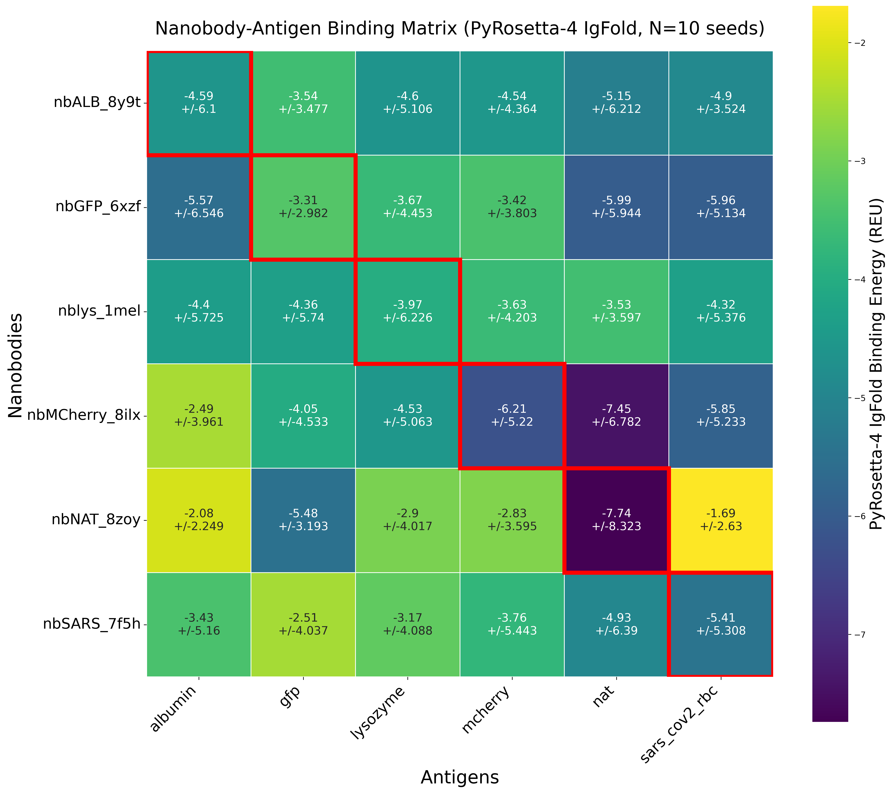

# Nanobody Evaluation Toolkit

This repository aims to provide a comprehensive computational framework for nanobody structure prediction, binding evaluation, and developmentability assessment through multiple complementary approaches.

This repository was created in the context of a Master Thesis in 2025 to organize and structure a variety of different tools used for in-silico nanobody evaluation.

## Repository Structure

```
nanobody-evaluation-toolkit/
├── abnativ/                            # Sequence naturalness prediction
├── aggreprot/                          # Sequence-based aggregation analysis  
├── aggrescan/                          # AGGRESCAN aggregation assessment
├── aggrescan3d_developmentability/     # Structure-based aggregation prediction
├── alphafold3_binding_specificity/     # AlphaFold3 binding evaluation
├── colabfold_binding_specificity/      # ColabFold-based binding analysis
├── deeploc2_1/                         # Subcellular localization prediction
├── haddock2_4_webservice_evaluation/   # HADDOCK docking evaluation
├── haddock3/                           # HADDOCK3 local installation
├── nanomelt/                           # Thermostability prediction
├── pyrosetta_4_evaluation/             # Rosetta modeling and docking
├── reference_nanobodies/               # SABDAB nanobody dataset
├── sample_structures/                  # Example nanobody structures
├── README_*.md                         # Individual tool documentation
└── requirements.txt                    # Python dependencies
```

## Evaluation Pipeline Overview

The toolkit provides comprehensive nanobody assessment through four major evaluation categories:

### 1. Naturalness & Sequence Quality

**[AbNatiV Analysis](abnativ/README_AbNativ.md)** - Nanobody sequence naturalness scoring
- Web server: https://www-cohsoftware.ch.cam.ac.uk/index.php/abnativ
- Threshold: 0.8 for native-like sequences
- **Results**: Framework regions show high conservation (0.910 ± 0.088), CDR3 displays lowest scores (0.428 ± 0.176)


### 2. Aggregation & Developmentability Assessment
<!--
**[Aggrescan3D Scorer](aggrescan3d_developmentability/README_Aggrescan3D.md)** - Structure-based aggregation prediction
- Input: CSV files from [A3D server](https://biocomp.chem.uw.edu.pl/A3D2)
- Thresholds: ≥0.40 (Accept), 0.25-0.39 (Conditional), <0.25 (Reject)
commented text -->
**[AGGRESCAN Integration](aggrescan/README_aggrescan.md)** - Na4vSS aggregation scoring
- **Results**: 92.6% of sequences show low aggregation risk (Na4vSS < 0)
- Mean score: -6.31 ± 4.89

<!--
**[AggreProt Integration](aggreprot/README_aggreprot.md)** - Sequence-based deep learning prediction
- Web server: https://loschmidt.chemi.muni.cz/aggreprot/
commented text -->
### 3. Thermostability & Localization

**[NanoMelt Integration](nanomelt/README_nanomelt.md)** - Thermostability prediction
- Web server: https://www-cohsoftware.ch.cam.ac.uk/index.php/nanomelt
- **Results**: Average Tm 67.3 ± 4.8°C, suitable for therapeutic applications


**[DeepLoc2.1 Analysis](deeploc2_1/README_DeepLoc_2_1.md)** - Subcellular localization prediction
- **Results**: 93.3% predicted as extracellular, 99.8% soluble (expected for therapeutic nanobodies)


<!-- 
**[SherLoc2 Analysis](README_SherLoc2.md)** - Containerized localization prediction
- Docker-based tool for comprehensive subcellular analysis
commented text -->
### 4. Binding Specificity Assessment

**[AlphaFold3 Analysis](alphafold3_binding_specificity/README_alphafold3_extern.md)** - Latest complex prediction
- External repository: [AlphaFold3 Binding Evaluation](https://github.com/ThorKlm/AlphaFold3-Prodigy-Antibody-Evaluation)
- Multi-seed pose consistency and binding energy estimation

**[ColabFold Evaluation](colabfold_binding_specificity/README_colabfold_binding_specificity.md)** - AlphaFold2-Multimer v3
- Google Colab-compatible binding assessment
- Deterministic seeding


**[HADDOCK Evaluation](haddock2_4_webservice_evaluation/README_haddock_2_4.md)** - Information-driven docking
- **Results**: No significant specificity for true binding pairs in 6×6 evaluation matrix


**[Rosetta Analysis](pyrosetta_4_evaluation/README_rosetta.md)** - Comprehensive modeling suite
- **Results**: No reasonable specificity detected (-4.3 ± 1.4 REU across all pairs)



## Environment Setup

**[Linux Environment Setup - WSL configuration for structure prediction tools](README_main_tools_and_wsl_setup.md)**
- IgFold: Nanobody structure prediction from sequence  
- AbNatiV: Local naturalness scoring
- HADDOCK3: Advanced protein-protein docking
- Rosetta3.14: Antibody-optimized modeling

## Key Findings

### Predictions of nanobody related features
- **Naturalness**: AbNatiV effectively distinguishes native-like sequences
- **Aggregation**: AGGRESCAN and AggreProt provide consistent risk assessment
- **Stability**: NanoMelt predictions align with therapeutic requirements
- **Localization**: Clear extracellular/soluble classification for therapeutic candidates

### Current Limitations
- **Binding Specificity**: Current methods (HADDOCK, Rosetta) show insufficient discrimination between true and false binding pairs, while the AlphaFold notebooks do show some but not ideal characteristics.
- **Structure Dependence**: Many tools require high-quality 3D structures
- **Computational Cost**: Local installations demand significant resources

## Workflow Implementation

### Quick Start
```bash
# Environment setup
pip install -r requirements.txt
# Follow WSL setup guide for Linux tools: README_main_tools_and_wsl_setup.md

# Web-based analysis (recommended)
# 1. AbNatiV: https://www-cohsoftware.ch.cam.ac.uk/index.php/abnativ
# 2. NanoMelt: https://www-cohsoftware.ch.cam.ac.uk/index.php/nanomelt  
# 3. AggreProt: https://loschmidt.chemi.muni.cz/aggreprot/
# 4. DeepLoc2.1: https://services.healthtech.dtu.dk/services/DeepLoc-2.1/
```

### Reference Dataset
**[SABDAB Nanobodies](reference_nanobodies/README_reference_nanobodies.md)** - Complete nanobody sequence retrieval
- Automated batch processing for web servers
- Standardized evaluation across 1000+ sequences

### Structure Prediction (Linux/WSL)
```bash
conda activate Rosetta
python run_igfold.py --sequences nanobody_sequences.fasta
```

### Binding Evaluation
```bash
# Google Colab (recommended)
# Open: pyrosetta_4_evaluation/rosetta_igfold_nanobody_binding_prediction_pipeline_GoogleColab.ipynb

# Local analysis
cd colabfold_binding_specificity/
python evaluate_binding_matrix.py
```

### Quality Assessment  
```bash
# Structure-based aggregation
cd aggrescan3d_developmentability/
python quality_score_prediction_by_single_amino_acid_values.py
```

## Integration Strategy

The toolkit provides systematic evaluation through:
- **Multi-dimensional assessment**: Naturalness, stability, aggregation, localization
- **Complementary approaches**: Sequence-based and structure-based methods
- **Scalable processing**: Web servers for high-throughput analysis
- **Standardized metrics**: Consistent scoring across different tools

**Recommendation**: Focus on naturalness and developmentability metrics for reliable candidate ranking, while treating binding predictions as preliminary assessments requiring experimental validation.

## Repository

**GitHub**: https://github.com/ThorKlm/nanobody-evaluation-toolkit

## References

- Briesemeister, S.; Blum, T.; Brady, S.; Lam, Y.; Kohlbacher, O. and Shatkay, H. (2009). SherLoc2: a high-accuracy hybrid method for predicting subcellular localization of proteins. *J. Proteome Res.* 8(11):5363-5366.
- Ramon A, Predeina O, Gaffey R, Kunz P, Onuoha S, and Sormanni P
Prediction of protein biophysical traits from limited data: a case study on nanobody thermostability through NanoMelt
MAbs 2025 doi.org/10.1080/19420862.2024.2442750
- Planas-Iglesias, J., Borko, S., Swiatkowski, J., Elias, M., Havlasek, M., Salamon, O., Grakova, E., Kunka, A., Martinovic, T., Damborsky, J., Martinovic, J., Bednar, D., 2024: AggreProt: a web server for predicting and engineering aggregation prone regions in proteins. Nucleic Acids Research 52 (W1): W159–W169.
- Abramson, Josh, et al. "Accurate structure prediction of biomolecular interactions with AlphaFold 3." Nature 630.8016 (2024): 493-500.
- Abramson, Josh, et al. "Addendum: Accurate structure prediction of biomolecular interactions with AlphaFold 3." Nature (2024): 1-1.
- Xue, Li C., et al. "PRODIGY: a web server for predicting the binding affinity of protein–protein complexes." Bioinformatics 32.23 (2016): 3676-3678.
- Vangone, Anna, and Alexandre MJJ Bonvin. "Contacts-based prediction of binding affinity in protein–protein complexes." elife 4 (2015): e07454.
- Aggrescan3D (A3D) 2.0: prediction and engineering of protein solubility, Nucleic Acids Research, gkz321, 2019
- Aggrescan3D standalone package for structure-based prediction of protein aggregation properties Bioinformatics, btz143, 2019
- AGGRESCAN3D (A3D): server for prediction of aggregation properties of protein structures, Nucleic Acids Research, 43, W306-W313, 2015
- Combining Structural Aggregation Propensity and Stability Predictions To Redesign Protein Solubility, Molecular Pharmaceutics, 10.1021/acs.molpharmaceut.8b00341, 2018
- The example guide for A3D 2.0: A3D 2.0 update for the prediction and optimization of protein solubility, Methods in Molecular Biology (biorxiv preprint), 2021
- Kastritis, Panagiotis L., et al. "Proteins feel more than they see: fine-tuning of binding affinity by properties of the non-interacting surface." Journal of molecular biology 426.14 (2014): 2632-2652.
- Mirdita M, Schütze K, Moriwaki Y, Heo L, Ovchinnikov S, Steinegger M. ColabFold: Making protein folding accessible to all. *Nature Methods*, 2022
- Evans R, O'Neill M, Pritzel A, et al. Protein complex prediction with AlphaFold-Multimer. *bioRxiv* 2021
- Almagro Armenteros, J. J., Sønderby, C. K., Sønderby, S. K., Nielsen, H., & Winther, O. (2017). DeepLoc: prediction of protein subcellular localization using deep learning. Bioinformatics, 33(21), 3387-3395.
- Thumuluri, V., Almagro Armenteros, J. J., Johansen, A. R., Nielsen, H., & Winther, O. (2022). DeepLoc 2.0: multi-label subcellular localization prediction using protein language models. Nucleic acids research, 50(W1), W228-W234.
- Ødum, M. T., Teufel, F., Thumuluri, V., Almagro Armenteros, J. J., Johansen, A. R., Winther, O., & Nielsen, H. (2024). DeepLoc 2.1: multi-label membrane protein type prediction using protein language models. Nucleic Acids Research, 52(W1), W215-W220.
- Ruffolo, J. A., Chu, L. S., Mahajan, S. P., & Gray, J. J. (2023). Fast, accurate antibody structure prediction from deep learning on massive set of natural antibodies. Nature communications, 14(1), 2389.
- Das, R., & Baker, D. (2008). Macromolecular modeling with rosetta. Annu. Rev. Biochem., 77(1), 363-382.
- Leaver-Fay, A., Tyka, M., Lewis, S. M., Lange, O. F., Thompson, J., Jacak, R., ... & Bradley, P. (2011). ROSETTA3: an object-oriented software suite for the simulation and design of macromolecules. In Methods in enzymology (Vol. 487, pp. 545-574). Academic Press.
- Chaudhury, S., Lyskov, S., & Gray, J. J. (2010). PyRosetta: a script-based interface for implementing molecular modeling algorithms using Rosetta. Bioinformatics, 26(5), 689-691.
- Ruffolo, J. A., Sulam, J., & Gray, J. J. (2022). Antibody structure prediction using interpretable deep learning. Patterns, 3(2).
- Adolf-Bryfogle, J., Labonte, J. W., Kraft, J. C., Shapovalov, M., Raemisch, S., Lütteke, T., ... & Schief, W. R. (2024). Growing Glycans in Rosetta: Accurate de novo glycan modeling, density fitting, and rational sequon design. PLoS computational biology, 20(6), e1011895.- Weitzner, B.D., Jeliazkov, J.R., Lyskov, S., Marze, N., Kuroda, D., Frick, R., Adolf-Bryfogle, J., Biswas, N., Dunbrack Jr, R.L., & Gray, J.J. (2017). Modeling and docking of antibody structures with Rosetta. Nature Protocols, 12(2), 401-416.
- Sircar, A., & Gray, J. J. (2010). SnugDock: paratope structural optimization during antibody-antigen docking compensates for errors in antibody homology models. PloS computational biology, 6(1), e1000644.
- Giulini, M., Reys, V., Teixeira, J. M., Jiménez-García, B., Honorato, R. V., Kravchenko, A., ... & Bonvin, A. M. (2025). HADDOCK3: A modular and versatile platform for integrative modelling of biomolecular complexes. bioRxiv, 2025-04.
- Van Zundert, G. C. P., Rodrigues, J. P. G. L. M., Trellet, M., Schmitz, C., Kastritis, P. L., Karaca, E., ... & Bonvin, A. M. J. J. (2016). The HADDOCK2. 2 web server: user-friendly integrative modeling of biomolecular complexes. Journal of molecular biology, 428(4), 720-725.
- Schneider, C., Raybould, M. I., & Deane, C. M. (2022). SAbDab in the age of biotherapeutics: updates including SAbDab-nano, the nanobody structure tracker. Nucleic acids research, 50(D1), D1368-D1372.
- Dunbar, J., Krawczyk, K., Leem, J., Baker, T., Fuchs, A., Georges, G., ... & Deane, C. M. (2014). SAbDab: the structural antibody database. Nucleic acids research, 42(D1), D1140-D1146.
- Raybould, M. I., Marks, C., Lewis, A. P., Shi, J., Bujotzek, A., Taddese, B., & Deane, C. M. (2020). Thera-SAbDab: the therapeutic structural antibody database. Nucleic acids research, 48(D1), D383-D388.
- Ramon, A., Ali, M., Atkinson, M., Saturnino, A., Didi, K., Visentin, C., ... & Sormanni, P. (2024). Assessing antibody and nanobody nativeness for hit selection and humanization with AbNatiV. Nature Machine Intelligence, 6(1), 74-91.

