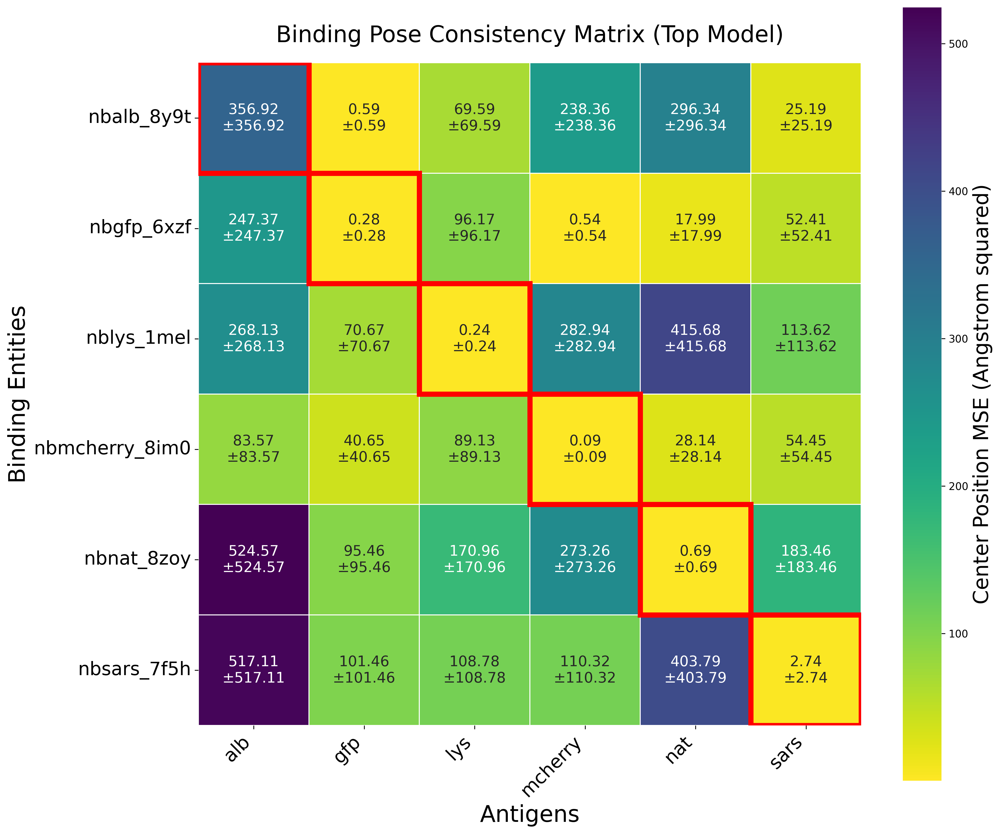

# AlphaFold3 Nanobody Evaluation Toolkit

The corresponding repository was outsourced to
https://github.com/ThorKlm/AlphaFold3-Prodigy-Antibody-Evaluation.

A computational framework for evaluating nanobody-antigen binding specificity using AlphaFold3 predictions, combining pose consistency analysis with ML-based binding energy estimation.

## Overview

Protein-protein binding specificity represents a fundamental challenge in computational structural biology. This toolkit provides a systematic approach to distinguish true binding pairs from non-specific interactions using AlphaFold3's multi-seed predictions, enabling quantitative assessment of binding pose consistency and affinity estimation.

## Methodology

The evaluation protocol integrates two complementary approaches:

### Binding Pose Consistency Analysis
Measures structural alignment stability across AlphaFold3 seeds using antigen-aligned mean squared error (MSE):
- **Top-model MSE**: Analysis using rank-1 predictions only
- **Weighted MSE**: Ensemble approach incorporating all 5 ranked models with decay weights [1.0, 0.8, 0.6, 0.4, 0.2]

### Binding Energy Estimation  
Quantifies interaction strength through dual methodologies:
- **Contact-based approximation**: Vectorized distance-dependent energy calculation
- **PRODIGY integration**: Machine learning-based binding affinity prediction from structure

## Key Results

The toolkit successfully discriminates binding specificity in a 5×5 nanobody-antigen test matrix:

### Top-Model MSE Matrix


*Binding pose consistency using rank-1 AlphaFold3 models. Lower MSE (brighter) indicates higher consistency,
with rather clear diagonal pattern showing true binding pairs successfully for most nanobodies.*

### Weighted MSE Matrix


*A
## Usage

### Standard Analysis
```bash
af3eval --input alphafold3_predictions --output ./results --mode standard
```

### MSE-Only Analysis
```bash
af3eval --input alphafold3_predictions --output ./results --mode mse-only
```

### Advanced Options
```bash
af3eval --input alphafold3_predictions --output ./results \
        --mode standard --temp 25.0 --cutoff 5.0 --min-seeds 5
```

## Input Requirements

**AlphaFold3 Format**: ZIP archives containing ranked CIF models
```
alphafold3_predictions/
├── fold_nbGFP_6xzf_gfp_seed_0a.zip
├── fold_nbGFP_6xzf_gfp_seed_1b.zip
└── ...
```

**Alternative Format**: AlphaFold2-Multimer directory structure
```bash
af3eval --input af2_predictions --format alphafold2_multimer
```

## Output Analysis

### Score Interpretation
- **MSE < 5.0 Ų**: High binding consistency (likely true pair)
- **MSE 5.0-20.0 Ų**: Moderate consistency 
- **MSE > 20.0 Ų**: Low consistency (likely non-binding)

### Binding Energy Scale
- **ΔG < -10 kcal/mol**: Strong binding affinity
- **ΔG -5 to -10 kcal/mol**: Moderate affinity
- **ΔG > -5 kcal/mol**: Weak or non-specific binding

## Dependencies

```bash
conda create -n af3eval python=3.9
conda activate af3eval
pip install biopython pandas numpy matplotlib seaborn
```

**Optional**: PRODIGY for enhanced binding energy prediction
```bash
pip install prodigy-binding
```

## Integration

Designed for integration into computational antibody design pipelines:

```python
from alphafold3_eval import Config, compute_antigen_aligned_mse
from alphafold3_eval.binding_analysis import calculate_binding_energies

# Evaluate binding consistency
mse_score = compute_antigen_aligned_mse(model_paths)

# Estimate binding affinity  
energy_results = calculate_binding_energies(structure, config)
```

## Limitations

- Requires multi-seed AlphaFold3 predictions for consistency analysis
- Structure-dependent assessment only
- Computational cost scales with number of models (5-20 minutes per combination)
- PRODIGY integration requires separate installation

## Scientific Context

This approach addresses the critical challenge of distinguishing specific from non-specific protein-protein interactions in computational design. By leveraging AlphaFold3's ensemble predictions, the methodology provides quantitative metrics for binding specificity that complement traditional docking approaches.

The framework demonstrates that true binding pairs exhibit significantly lower pose variance across prediction seeds compared to non-specific combinations, providing a computational signature for binding specificity assessment. This project was developed in the context of a broader nanobody evaluation toolkit:

https://github.com/ThorKlm/nanobody-evaluation-toolkit.


## References

- Abramson, Josh, et al. "Accurate structure prediction of biomolecular interactions with AlphaFold 3." Nature 630.8016 (2024): 493-500.
- Abramson, Josh, et al. "Addendum: Accurate structure prediction of biomolecular interactions with AlphaFold 3." Nature (2024): 1-1.
- Xue, Li C., et al. "PRODIGY: a web server for predicting the binding affinity of protein–protein complexes." Bioinformatics 32.23 (2016): 3676-3678.
- Vangone, Anna, and Alexandre MJJ Bonvin. "Contacts-based prediction of binding affinity in protein–protein complexes." elife 4 (2015): e07454.
- Kastritis, Panagiotis L., et al. "Proteins feel more than they see: fine-tuning of binding affinity by properties of the non-interacting surface." Journal of molecular biology 426.14 (2014): 2632-2652.