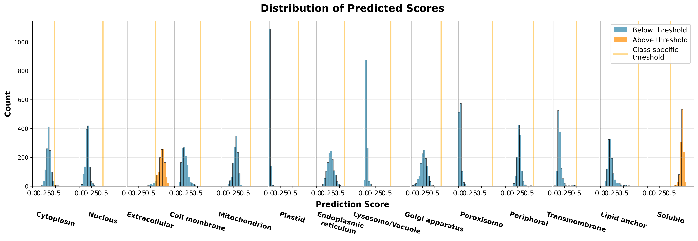

# DeepLoc 2.1 Integration for Subcellular Localization Prediction

Deep learning-based prediction of eukaryotic protein subcellular localization using multi-label classification for 10 cellular compartments and 4 membrane associations.

## Methodology

DeepLoc 2.1 predicts where proteins end up in eukaryotic cells and how they associate with membranes. The tool distinguishes between major cellular locations (nucleus, cytoplasm, mitochondria, etc.) and membrane types (transmembrane, peripheral, lipid anchor, soluble).

## Implementation

**Web Server:** https://services.healthtech.dtu.dk/services/DeepLoc-2.1/

- **Input**: FASTA sequences (max 500, min 10 AA)
- **Output**: Localization predictions with confidence scores
- **Models**: Slow (high-quality) or Fast (high-throughput)
- **Limits**: 4000 AA (slow) or 1022 AA (fast), 4-hour execution

## Integration Context

Provides cellular localization context for nanobody targets, helping assess accessibility and potential therapeutic challenges based on subcellular distribution patterns.

## Usage Notes

Free access including commercial use. For batch processing >250 sequences.

## Prediction Thresholds

DeepLoc 2.1 uses probability thresholds to determine positive predictions. A localization or membrane type is predicted if its probability exceeds the threshold below:

### Subcellular Localizations
| Localization | Threshold |
|--------------|-----------|
| Cytoplasm | 0.4761 |
| Nucleus | 0.5014 |
| Extracellular | 0.6173 |
| Cell membrane | 0.5646 |
| Mitochondrion | 0.6220 |
| Plastid | 0.6395 |
| Endoplasmic reticulum | 0.6090 |
| Lysosome/Vacuole | 0.5848 |
| Golgi apparatus | 0.6494 |
| Peroxisome | 0.7364 |

### Membrane Types
| Membrane Type | Threshold |
|---------------|-----------|
| Peripheral | 0.60 |
| Transmembrane | 0.51 |
| Lipid anchor | 0.82 |
| Soluble | 0.50 |

## Analysis Results

Analysis of nanobody sequences from SABDAB using DeepLoc 2.1 shows clear localization patterns.

### Key Findings

Most nanobodies (93.3%) are predicted as **extracellular**, which makes sense since they're secreted therapeutic proteins. Other localizations are minimal: cytoplasm (1.2%), nucleus (0.1%), cell membrane (0.2%), mitochondrion (0.1%), with specialized organelles at ≤0.0%.

For membrane association, nearly all sequences (99.8%) are **soluble**, with very few membrane-bound forms: peripheral (0.1%), transmembrane (0.1%), lipid anchor (0.0%).

### Figures

*Figure 1: Subcellular localization predictions above thresholds. Extracellular dominates as expected for therapeutic antibodies.*

*Figure 2: Prediction score distributions. Orange bars = above threshold (positive), blue bars = below threshold (negative). Shows clear extracellular bias in the data.*

The extracellular dominance fits with nanobodies being naturally secreted antibody fragments from camels. The small fraction of intracellular predictions (6.7%) might be noise or crystallographic artifacts in the database.

### Interpretation Notes
- **Multiple predictions possible**: Proteins can be predicted for multiple localizations if probabilities exceed respective thresholds
- **Threshold variation**: Higher thresholds (e.g., Peroxisome: 0.7364) indicate more stringent prediction criteria
- **CSV output**: Results include raw probabilities and binary predictions based on these thresholds
- **Confidence assessment**: Compare raw probabilities to thresholds to assess prediction confidence
  
(All based on the webpage content (as of June 2025) after running the experiments).

## References

- Almagro Armenteros, J. J., Sønderby, C. K., Sønderby, S. K., Nielsen, H., & Winther, O. (2017). DeepLoc: prediction of protein subcellular localization using deep learning. Bioinformatics, 33(21), 3387-3395.
- Thumuluri, V., Almagro Armenteros, J. J., Johansen, A. R., Nielsen, H., & Winther, O. (2022). DeepLoc 2.0: multi-label subcellular localization prediction using protein language models. Nucleic acids research, 50(W1), W228-W234.
- Ødum, M. T., Teufel, F., Thumuluri, V., Almagro Armenteros, J. J., Johansen, A. R., Winther, O., & Nielsen, H. (2024). DeepLoc 2.1: multi-label membrane protein type prediction using protein language models. Nucleic Acids Research, 52(W1), W215-W220.

**Institution**: DTU Health Tech, Technical University of Denmark  
**Contact**: Henrik Nielsen