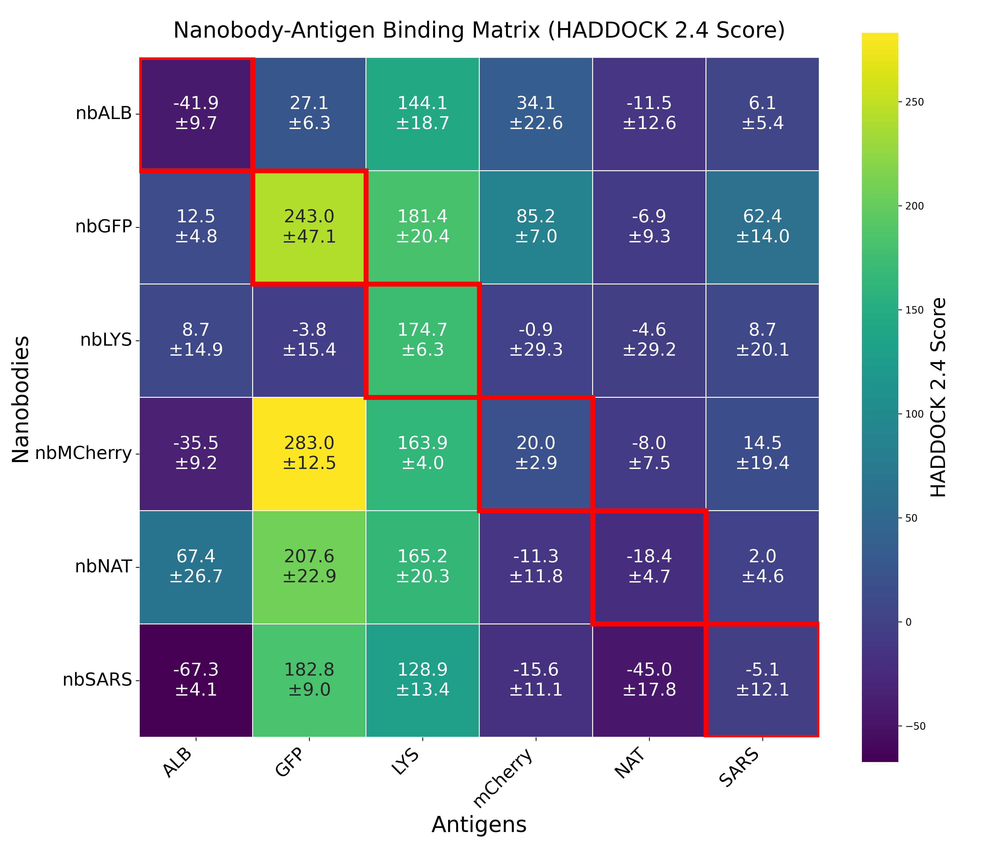

# HADDOCK 2.4 Webserver based Nanobody-Antigen Binding Evaluation

## Project Overview

This project evaluates nanobody-antigen binding predictions using the HADDOCK 2.4 webserver. We test a 5x5 matrix of nanobody-antigen combinations to see how well HADDOCK can distinguish real binding pairs from non-binding combinations.

**What we're testing:**
- 6 different nanobodies × 6 different antigens = 36 total combinations
- Expected: 6 "true" binding pairs (diagonal matches) + 30 "false" combinations  
- Goal: Determine if HADDOCK scores correctly identify the real binders

## Files in this Project

### Analysis Files
- `haddock2_4_webserver_evaluation.ipynb` - Main analysis notebook for parsing and visualizing results
- `haddock2_4_webserver_evaluation_experiment.txt` - Example HADDOCK webserver results file

### Structure Files
- `sample_structures/` - Directory containing nanobody and antigen PDB files for HADDOCK submission

## Structure Preparation

### Nanobody Structures
Nanobody 3D structures should be generated using IgFold (assumes previous installation):

```python
# Generate nanobody structures from sequences
from igfold import IgFoldRunner
from igfold.refine.pyrosetta_ref import init_pyrosetta

init_pyrosetta()
igfold = IgFoldRunner()

# For each nanobody sequence
sequences = {"H": "YOUR_NANOBODY_SEQUENCE_HERE"}
igfold.fold(
   "sample_structures/nanobody_name.pdb",
   sequences=sequences,
   do_refine=True,
   do_renum=False
)
```
### Antigen Structures
For antigen structures:

First choice: Download experimental structures from UniProt/PDB if available
Backup option: Use AlphaFold3 predictions if no experimental structure exists
Save all antigen structures in sample_structures/ directory with descriptive names

### HADDOCK 2.4 Webserver Setup
1. Create Account

Go to https://rascar.science.uu.nl/haddock2.4/
Click "Register" to create a free account for non-profit use
Verify your email and log in

2. Submit Docking Jobs
For each of the 25 nanobody-antigen combinations:

Click "Submit a new job"
Upload nanobody PDB file as "Molecule 1"
Upload antigen PDB file as "Molecule 2"
Use job name format: nanobody_antigen (e.g., nbGFP_GFP)
Use default HADDOCK settings unless you have specific restraints
Submit job and note the job ID

3. Monitor Jobs

Jobs can take several hours to days depending on server load
Check your workspace regularly for completed jobs
Download results when jobs finish

4. Collect Results

For each completed job, copy the results summary
Paste all results into a single text file
Format should match the example file provided

Expected Results Format
Your results file should contain blocks like this for each combination:
```
nbGFP_GFP
https://rascar.science.uu.nl/haddock2.4/result/8625168504/501578-nbGFP_GFP
Cluster 1

HADDOCK score	243.0 +/- 47.1
Cluster size	4
RMSD from the overall lowest-energy structure	21.3 +/- 0.1
Van der Waals energy	-72.2 +/- 2.7
Electrostatic energy	-436.2 +/- 70.6
Desolvation energy	2.9 +/- 2.6
Restraints violation energy	3995.9 +/- 311.7
Buried Surface Area	2583.9 +/- 122.8
Z-Score	-1.0
```

### Running the Analysis
1. Setup Environment
```bash
# Activate your conda environment (assuming previous setup)
conda activate nanobody-eval
```

## Start Jupyter notebook
jupyter notebook haddock2_4_webserver_evaluation.ipynb
2. Update File Paths
In the notebook, change the file path to your results:
python# Update this path to your HADDOCK results file
filename = "path/to/your/haddock_results.txt"
3. Run Analysis
Execute all cells in the notebook to generate:

5×5 binding matrix heatmap
Quality assessment of results
Ranking of binding predictions
CSV files for further analysis

Understanding Results
HADDOCK Metrics

HADDOCK Score: Lower values = better predicted binding (primary metric)
Z-Score: More negative = more statistically significant (prefer < -1.5)
Restraints Violations: Should be < 100 for reliable results
Buried Surface Area: Higher typically indicates stronger binding interface

Quality Assessment
The analysis categorizes results as:
reliable: Reliable predictions (Z-score < -1.0 AND restraints < 500)
unreliable: Unreliable predictions (poor Z-score OR high restraints)

### Success Indicators
A successful evaluation should show:
True binding pairs (diagonal) score better than false combinations
Clear separation between good and bad predictions
Low restraints violations for true binders
Significant Z-scores for true binding pairs

### Output Files
The analysis generates:

haddock_results.csv - Complete parsed data with quality flags
binding_matrix.csv - 6×6 matrix suitable for Excel/etc. analysis
Interactive heatmap visualization in the notebook

### Results of the here conducted experiments

Sadly for the 6x6 experiments conducted here, 
there was no significant trend w.r.t. the true-positive diagonal when compared to false positives.



Confusion matrix of nanobody antigen pairs with true matches on the diagonal
and some slight structural similarity/ evolutionary proximity between GFP and mCherry.
As visible, the diagonal is not significantly more pronounced that false combinations.
### Conclusion
As this feasibility check did not resulted in reasonable accuracies, it was concluded that the HADDOCK2.4 online tool 
would not be a significant addition in the here developed nanobody evaluation pipeline.

### Disclaimer
This is only an exploratory evaluation/ sanity check and would due to the low sample number not suffice 
to evaluate HADDOCK 2.4's overall performance/ capabilities.